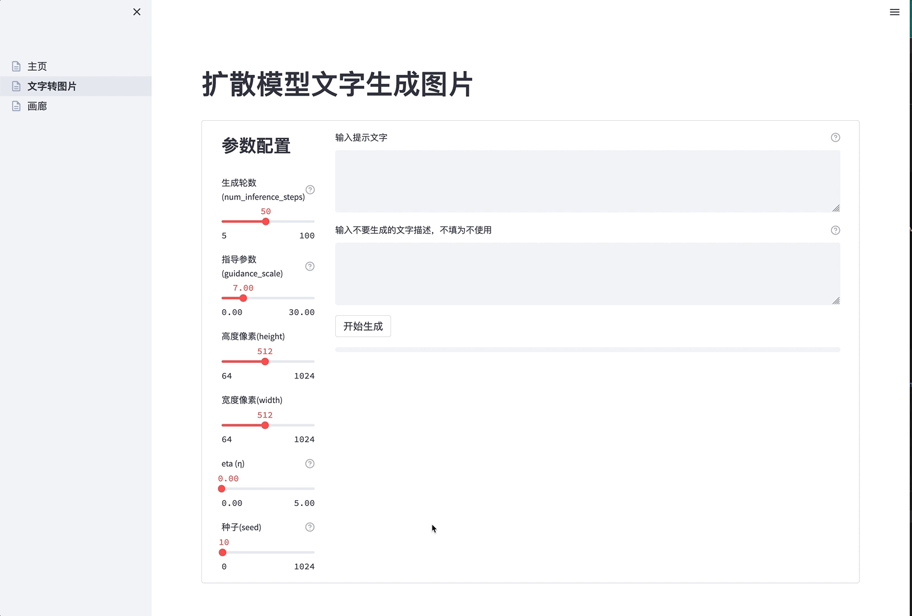
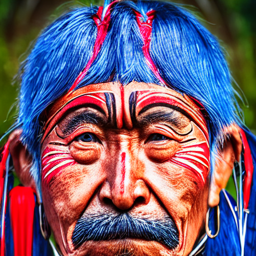
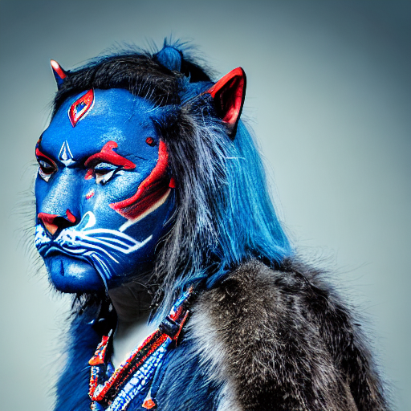

[**中文说明**](https://github.com/LowinLi/stable-diffusion-streamlit/blob/main/README_CN.md) | [**English**](https://github.com/LowinLi/stable-diffusion-streamlit/blob/main/README.md)

# 🎨 Stable Diffusion Streamlit

[](https://hub.docker.com/r/lowinli98/stable-diffusion-streamlit-onnxquantized)
[](LICENSE)
[](https://www.python.org/)
[](https://streamlit.io/)

> 🚀 A beautiful web application for Stable Diffusion text-to-image generation with **75% memory reduction** through ONNX quantization

## 📋 Table of Contents

- [✨ Features](#-features)
- [🚀 Introduction](#-introduction)
- [🛠️ Getting Started](#️-getting-started)
- [📊 Quantization Performance](#-quantization-performance)
- [📈 Streamlit Progress Bar](#-streamlit-progress-bar)
- [📝 To Do](#-to-do)
- [🤝 Contributing](#-contributing)
- [❓ Get Help](#-get-help)
- [🙏 Acknowledgements](#-acknowledgements)

## ✨ Features

- 🎨 **Text-to-Image Generation**: Create stunning images from text prompts
- 🔧 **ONNX Quantization**: 75% memory reduction with minimal quality loss
- 🌐 **Web Interface**: Beautiful Streamlit-based user interface
- 🖼️ **Gallery View**: Browse and manage generated images
- 🐳 **Docker Support**: Easy deployment with Docker Compose
- 🇨🇳 **Chinese Interface**: Native Chinese language support
- ⚡ **Fast Inference**: Optimized for CPU execution

## 🚀 Introduction

+ Create beautiful apps using [Streamlit](https://github.com/streamlit/streamlit) to test [CompVis/stable-diffusion-v1-4](https://huggingface.co/CompVis/stable-diffusion-v1-4) model quantized by [OnnxRuntime](https://github.com/microsoft/onnxruntime) **cutting down memory 75%**.
    + **Streamlit**:
      + an open-source app framework for Machine Learning and Data Science teams. Create beautiful web apps in minutes.
    + **CompVis/stable-diffusion-v1-4**:
        + a latent text-to-image diffusion model capable of generating photo-realistic images given any text input.
    + **OnnxRuntime**:
        + a cross-platform, faster inference and lower costs accelerator for machine learning models.

    
## 🛠️ Getting Started

### 2.1. Deployment
+ docker-compose up -d
```yaml
version: "2.3"
services:
  stable-diffusion-streamlit-onnxquantized:
    container_name: stable-diffusion-streamlit-onnxquantized
    image: lowinli98/stable-diffusion-streamlit-onnxquantized:v0.2
    expose:
      - 8501
    ports:
      - "8501:8501"
    environment:
      - APP_TITLE=Stable Diffusion Streamlit
    restart: always
    volumes:
      - /etc/localtime:/etc/localtime
      - ./volume:/app/pages/model/result
```

### 2.2. Usage
+ 2.2.1. Copy an awesome prompt from Blogs like [best-100-stable-diffusion-prompts](https://mpost.io/best-100-stable-diffusion-prompts-the-most-beautiful-ai-text-to-image-prompts/) or [50-text-to-image-prompts-for-ai](https://decentralizedcreator.com/50-text-to-image-prompts-for-ai-art-generator-stable-diffusion-a-visual-treat-inside/)
+ 2.2.2. Open http://localhost:8501 and click "文本转图片" on the left sidebar.
+ 2.2.3. Fix the runtime parameters, paste your prompt into the text area and click the "开始生成" button.

    

+ 2.2.4. Wait for a while until the progress bar goes to the end, then you will get a generated image.

    

+ 2.2.5. Click "画廊" on the left sidebar to see all the images you had generated.

    


## 3. Quantization Performance
+ The model in the docker container has been quantized by OnnxRuntime in the building of the docker image.

  + [dockerfile](https://github.com/LowinLi/stable-diffusion-streamlit/blob/main/docker/dockerfile)
  + [building progress in Github Action](https://github.com/LowinLi/stable-diffusion-streamlit/actions/runs/3202674839/jobs/5231895605)

+ The quantized model will be smaller and cut down the inference time a little(UINT8), while the performance of the image generated is almost the same as the original model.
+ This is an amazing feature because [CompVis/stable-diffusion-v1-4](https://huggingface.co/CompVis/stable-diffusion-v1-4) can be deployed on most home computers. The following table shows the comparison of the quantized model and the original model.

---
| model | memory used | inference 49 steps waste time |
| --- | --- | --- |
| pytorch | 5.2GB | 6m56s |
| onnx | 5.0GB | 4m34s |
| onnx-quantized(UINT8) | 1.3GB | 4m29s |

+ CPU: 
  + Intel(R) Xeon(R) CPU E5-2650 v3 @ 2.30GHz 
  + 10 core


+ image generated by PyTorch model

    
+ image generated by Onnx model

    
+ image generated by Onnx-Quantized(UINT8) model

    

## 4. Streamlit Progress Bar
To generate an awesome image, the model needs to be inferences with many steps. So it will take a long time to finish the whole pipeline. To make the user experience better, a progress bar is added to show the pipeline progress. 
With another thread in Python, the progress bar can be updated by the pipeline scheduler counter.


## 📝 To Do

- [ ] Add the Text-Guided Image-to-Image Pipeline in [Huggingface/Diffusers](https://huggingface.co/docs/diffusers/using-diffusers/img2img)
- [ ] Add the Text-Guided Image-Inpainting Pipeline in [Huggingface/Diffusers](https://huggingface.co/docs/diffusers/using-diffusers/inpaint)
- [ ] Add support for different Stable Diffusion models
- [ ] Implement batch processing for multiple images
- [ ] Add image upscaling options
- [ ] Support for custom model fine-tuning

## 🤝 Contributing

We welcome contributions! Please see our [Contributing Guide](CONTRIBUTING.md) for details.

- 🐛 **Bug Reports**: Use our [bug report template](.github/ISSUE_TEMPLATE/bug_report.md)
- 💡 **Feature Requests**: Use our [feature request template](.github/ISSUE_TEMPLATE/feature_request.md)
- 📖 **Documentation**: Help improve our documentation
- 🧪 **Testing**: Help us test new features

Please read our [Code of Conduct](CODE_OF_CONDUCT.md) before contributing.

## ❓ Get Help

+ 📧 Contact me at lowinli@outlook.com
+ 🐛 If appropriate, open an issue on GitHub
+ 💬 Join our discussions in the Issues section

## 🙏 Acknowledgements

+ [Huggingface/Diffusers](https://github.com/huggingface/diffusers)
+ [CompVis/stable-diffusion](https://github.com/CompVis/stable-diffusion)
+ [Streamlit](https://github.com/streamlit/streamlit)
+ [OnnxRuntime](https://github.com/microsoft/onnxruntime)
