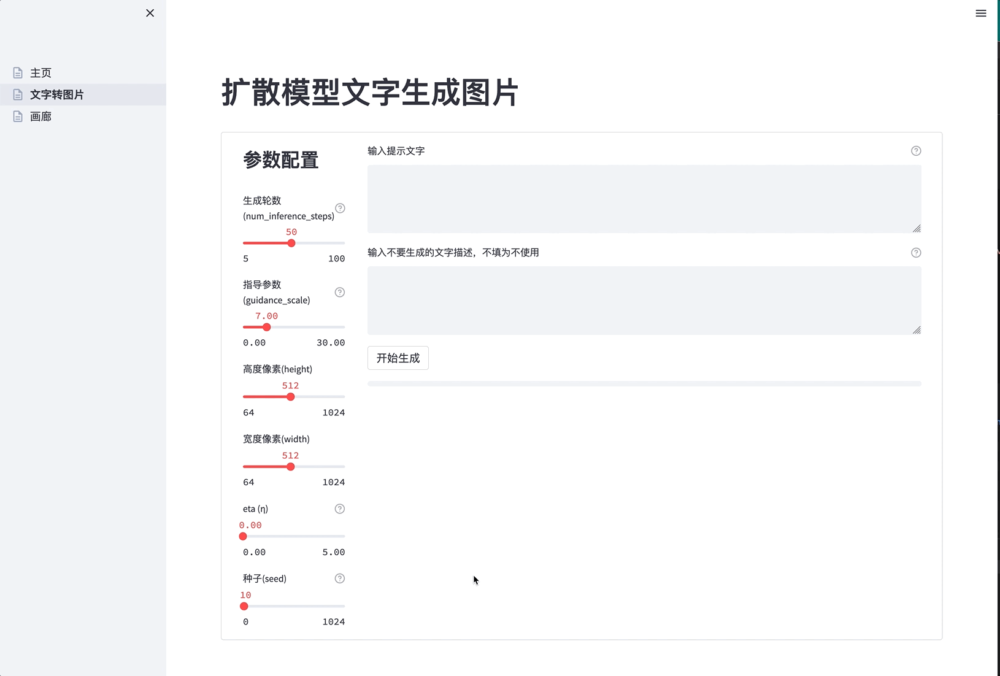
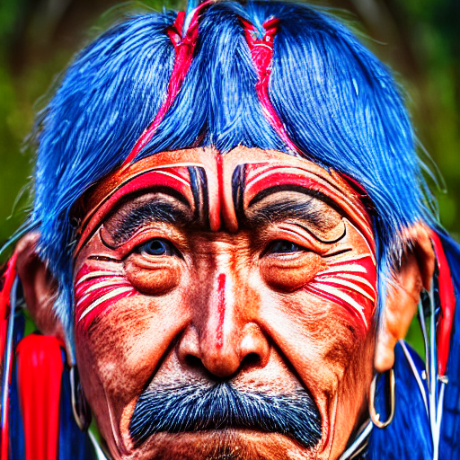
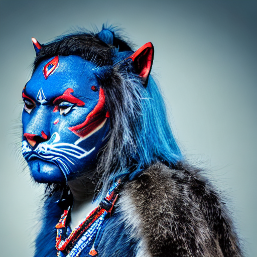

[**中文说明**](https://github.com/LowinLi/stable-diffusion-streamlit/blob/main/README_CN.md) | [**English**](https://github.com/LowinLi/stable-diffusion-streamlit/blob/main/README.md)

# stable-diffusion-streamlit

- [1.Introduction](#1-introduction)
- [2.Getting Started](#2-getting-started)
- [3.Quantization Performance](#3-quantization-performance)
- [4.Streamlit Progress Bar](#4-streamlit-progress-bar)
- [5.To Do](#5-to-do)
- [6.Get Help](#6-get-help)
- [7.Acknowledgements](#7-acknowledgements)

## 1. Introduction

+ **Create beautiful apps using [Streamlit](https://github.com/streamlit/streamlit) to test [CompVis/stable-diffusion-v1-4](https://huggingface.co/CompVis/stable-diffusion-v1-4) model quantized by [OnnxRuntime](https://github.com/microsoft/onnxruntime)** cutting down memory 75%.
    + **Streamlit**:
      + an open-source app framework for Machine Learning and Data Science teams. Create beautiful web apps in minutes.
    + **CompVis/stable-diffusion-v1-4**:
        + a latent text-to-image diffusion model capable of generating photo-realistic images given any text input.
    + **OnnxRuntime**:
        + a cross-platform, faster inference and lower costs accelerator for machine learning models.

    
## 2. Getting Started

### 2.1. Deployment
+ docker-compose up -d
```yaml
version: "2.3"
services:
  stable-diffusion-streamlit-onnxquantized:
    container_name: stable-diffusion-streamlit-onnxquantized
    image: lowinli98/stable-diffusion-streamlit-onnxquantized:v0.2
    expose:
      - 8501
    ports:
      - "8501:8501"
    environment:
      - APP_TITLE=Stable Diffusion Streamlit
    restart: always
    volumes:
      - /etc/localtime:/etc/localtime
      - ./volume:/app/pages/model/result
```

### 2.2. Usage
+ 2.2.1. Copy an awesome prompt from Blogs like [best-100-stable-diffusion-prompts](https://mpost.io/best-100-stable-diffusion-prompts-the-most-beautiful-ai-text-to-image-prompts/) or [50-text-to-image-prompts-for-ai](https://decentralizedcreator.com/50-text-to-image-prompts-for-ai-art-generator-stable-diffusion-a-visual-treat-inside/)
+ 2.2.2. Open http://localhost:8501 and click "文本转图片" on the left sidebar.
+ 2.2.3. Fix the runtime parameters, paste your prompt into the text area and click the "开始生成" button.

    

+ 2.2.4. Wait for a while until the progress bar goes to the end, then you will get a generated image.

    

+ 2.2.5. Click "画廊" on the left sidebar to see all the images you had generated.

    


## 3. Quantization Performance
+ The model in the docker container has been quantized by OnnxRuntime in the building of the image.

  + [dockerfile](https://github.com/LowinLi/stable-diffusion-streamlit/blob/main/docker/dockerfile)
  + [building progress in Github Action](https://github.com/LowinLi/stable-diffusion-streamlit/actions/runs/3202674839/jobs/5231895605)

+ The quantized model will be smaller and cut down the inference time a little(UINT8), while the performance of the image generated is almost the same as the original model.
+ This is an amazing feature because [CompVis/stable-diffusion-v1-4](https://huggingface.co/CompVis/stable-diffusion-v1-4) can be deployed on most home computers. The following table shows the comparison of the quantized model and the original model.

---
| model | memory used | inference 49 steps waste time |
| --- | --- | --- |
| pytorch | 5.2GB | 6m56s |
| onnx | 5.0GB | 4m34s |
| onnx-quantized(UINT8) | 1.3GB | 4m29s |

+ CPU: 
  + Intel(R) Xeon(R) CPU E5-2650 v3 @ 2.30GHz 
  + 10 core


+ image generated by PyTorch model

    
+ image generated by Onnx model

    
+ image generated by Onnx-Quantized(UINT8) model

    

## 4. Streamlit Progress Bar
To generate an awesome image, the model needs to be inferences with many steps. So it will take a long time to finish the whole pipeline. To make the user experience better, a progress bar is added to show the pipeline progress. 
With another thread in Python, the progress bar can be updated by the pipeline scheduler counter.


## 5. To Do

- [ ] Add the Text-Guided Image-to-Image Pipeline in [Huggingface/Diffusers](https://huggingface.co/docs/diffusers/using-diffusers/img2img)
- [ ] Add the Text-Guided Image-Inpainting Pipeline in [Huggingface/Diffusers](https://huggingface.co/docs/diffusers/using-diffusers/inpaint)

## 6. Get Help

+ Contact me at lowinli@outlook.com
+ If appropriate, open an issue on GitHub

## 7. Acknowledgements

+ [Huggingface/Diffusers](https://github.com/huggingface/diffusers)
+ [CompVis/stable-diffusion](https://github.com/CompVis/stable-diffusion)
+ [Streamlit](https://github.com/streamlit/streamlit)
+ [OnnxRuntime](https://github.com/microsoft/onnxruntime)
