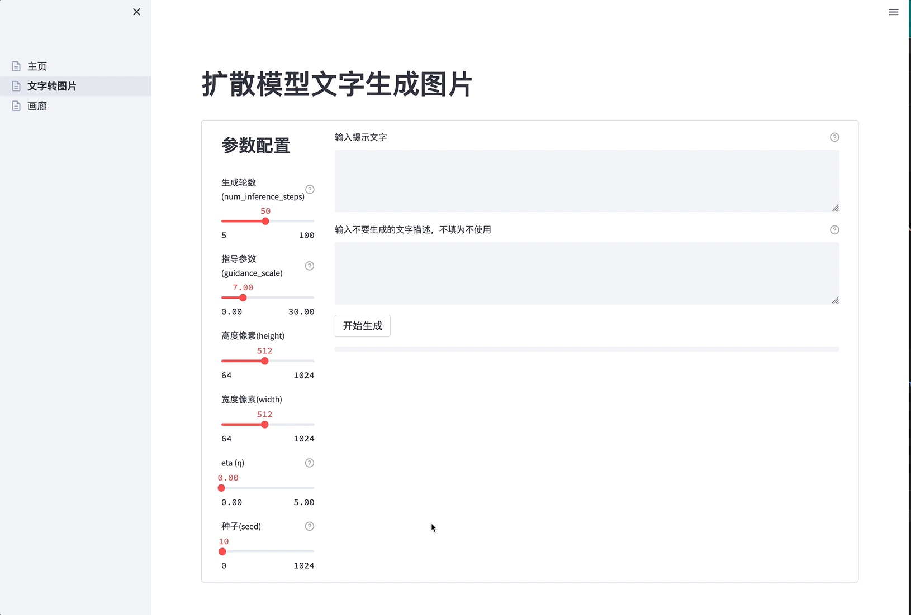
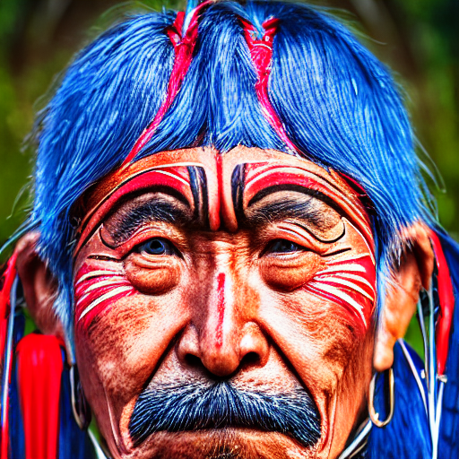
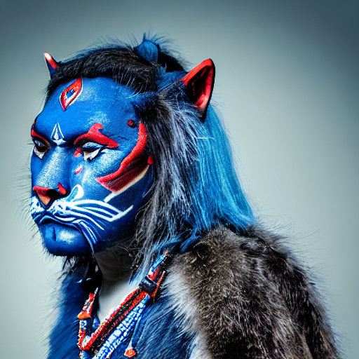

[**中文说明**](https://github.com/LowinLi/stable-diffusion-streamlit/blob/main/README_CN.md) | [**English**](https://github.com/LowinLi/stable-diffusion-streamlit/blob/main/README.md)

# stable-diffusion-streamlit

- [1.简介](#1-简介)
- [2.快速开始](#2-快速开始)
- [3.模型量化提速表现](#3-模型量化提速表现)
- [4.Streamlit进度条](#4-Streamlit进度条)
- [5.下一步](#5-下一步)
- [6.帮助](#6-帮助)
- [7.致谢](#7-致谢)

## 1. 简介

+ **使用[Streamlit](https://github.com/streamlit/streamlit)构建一个Web服务，测试使用[OnnxRuntime](https://github.com/microsoft/onnxruntime)量化压缩后的[CompVis/stable-diffusion-v1-4](https://huggingface.co/CompVis/stable-diffusion-v1-4)模型做图片生成**.
    + **Streamlit**:
      + 一个流行的开源框架，可以快速搭建机器学习和数据科学团队的Web应用。
    + **CompVis/stable-diffusion-v1-4**:
        + 一个流行的扩散模型，可以通过文字提示生成栩栩如生的高质量图片。
    + **OnnxRuntime**:
        + 微软推出的一款推理框架，用户可以非常便利的量化压缩模型。

    
## 2. 快速开始

### 2.1. 部署
+ docker-compose up -d
```yaml
version: "2.3"
services:
  stable-diffusion-streamlit-onnxquantized:
    container_name: stable-diffusion-streamlit-onnxquantized
    image: lowinli98/stable-diffusion-streamlit-onnxquantized:v0.2
    expose:
      - 8501
    ports:
      - "8501:8501"
    environment:
      - APP_TITLE=Stable Diffusion Streamlit
    restart: always
    volumes:
      - /etc/localtime:/etc/localtime
      - ./volume:/app/pages/model/result
```

### 2.2. 使用
+ 2.2.1. 从博客[best-100-stable-diffusion-prompts](https://mpost.io/best-100-stable-diffusion-prompts-the-most-beautiful-ai-text-to-image-prompts/)或[50-text-to-image-prompts-for-ai](https://decentralizedcreator.com/50-text-to-image-prompts-for-ai-art-generator-stable-diffusion-a-visual-treat-inside/)复制一个文本提示。
+ 2.2.2. 打开http://localhost:8501，在侧边栏点击"文本转图片"。
+ 2.2.3. 修改运行参数, 粘贴提示，点击"开始生成"。

    

+ 2.2.4. 待进度条走完后，页面直接展示生成的图片

    

+ 2.2.5. 点击侧边栏的"画廊"查看所有历史生成的图片

    


## 3. 模型量化提速表现
+ 服务中使用的模型已经在打镜像阶段就做了OnnxRuntime量化压缩处理，详见：

  + [dockerfile](https://github.com/LowinLi/stable-diffusion-streamlit/blob/main/docker/dockerfile)
  + [Github Action的镜像构建日志](https://github.com/LowinLi/stable-diffusion-streamlit/actions/runs/3202674839/jobs/5231895605)

+ 量化后的模型尺寸降低很多、推理速度提高一点点(UINT8), 同时保持和原模型几乎一样的生成图片质量.
+ 这一点意味着，[CompVis/stable-diffusion-v1-4](https://huggingface.co/CompVis/stable-diffusion-v1-4)模型可以被部署在大多数家用电脑上，并进行调试。以下是几种模型的比较：

---
| 模型 | 内存 | 49步推断用时 |
| --- | --- | --- |
| pytorch | 5.2GB | 6m56s |
| onnx | 5.0GB | 4m34s |
| onnx-quantized(UINT8) | 1.3GB | 4m29s |

+ CPU: 
  + Intel(R) Xeon(R) CPU E5-2650 v3 @ 2.30GHz 
  + 10 core


+ PyTorch模型生成的图片

    
+ Onnx模型生成的图片

    
+ Onnx-quantized(UINT8)模型生成的图片

    

## 4. Streamlit进度条
为了生成高质量图片，扩散模型一般要推断很多步，这会比较耗时。为了提升用户体验，在Streamlit页面做了一个进度条，通过另一个线程，监控推断步数，并更新到进度条中。

## 5. 下一步

- [ ] 增加[Huggingface/Diffusers](https://huggingface.co/docs/diffusers/using-diffusers/img2img)中的图像生成图像流程
- [ ] 增加[Huggingface/Diffusers](https://huggingface.co/docs/diffusers/using-diffusers/inpaint)中的抠图生成图像流程

## 6. 帮助

+ 联系我的邮箱lowinli@outlook.com
+ 有任何问题，欢迎在Github上提Issue

## 7. 致谢

+ [Huggingface/Diffusers](https://github.com/huggingface/diffusers)
+ [CompVis/stable-diffusion](https://github.com/CompVis/stable-diffusion)
+ [Streamlit](https://github.com/streamlit/streamlit)
+ [OnnxRuntime](https://github.com/microsoft/onnxruntime)
